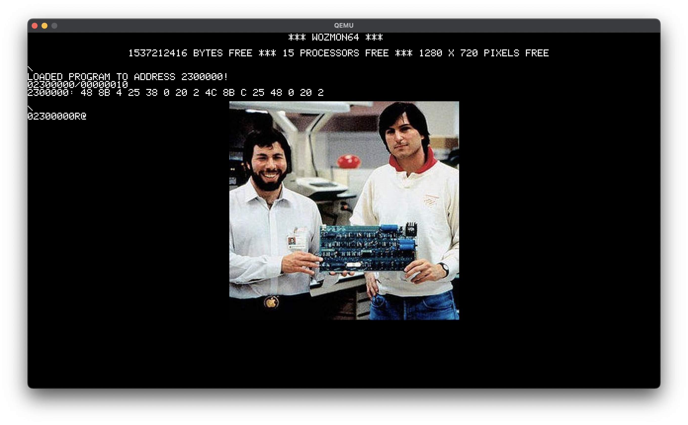

# Wozmon64
---

---
## Overview
Please see [the plan](https://github.com/DanB91/Wozmon64/blob/main/Plan.md).
## Requirements
- Either macOS or Linux. Windows may work, but can be difficult to get QEMU to run properly on.
- Zig compiler 0.11.0-dev.3867+ff37ccd29 or newer. Pulling down the latest build is your best bet.
- qemu-system-x86_64 in $PATH.
- If you want to run bare-metal:
    - Flash drive
    - PC with UEFI firmware.
    - x86-64 CPU that has more than one core.
    - Graphics card/chip that supports the Graphics Output Protocol (which most modern  chips should).

## Compile
- Run `zig build run` which should build and run QEMU.
- If you want to try running bare metal on your machine:
    - Insert your flash drive into your dev machine.
    - Run `cp -r zig-out/img/EFI/ <your flash drive mount point>`
    - Insert your flash drive into the target machine.
    - Boot your machine from your machine in the UEFI/BIOS settings.
    - If you are successful you should reach the Wozmon64 prompt.
    - If unsuccessful, your machine will reboot or hang.

## Usage
Wozmon64 is line based and support similar syntax as the original WozMon. That is, the "commands" you enter are memory addresses and whether you want to read from them, write to them, or execute them. In the examples below, `[ENTER]` will represent hitting the enter key, while `[RESPONSE]` means that's what the monitor responded with.

- Entering a hex value is interpreted as a memory address. Wozmon64 will output the value at that address. Example:

    ```
    C000F0[ENTER]
    [RESPONSE]C0_00F0: 04
    ```

- Entering a range will print out a range of bytes (destination exclusive). Example:

    ```
    C000F0.C000F4[ENTER]
    [RESPONSE]C0_00F0: 00 33 55 66
    ```

- Entering a "." followed by an address will print a range of address following the last "opened" address. Example:
    ```
    C000F0.C000F4[ENTER]
    [RESPONSE]C0_00F0: 00 33 55 66

    .C0000F8[ENTER]
   [RESPONSE] C0_00F5: 11 CD AB
    ```
- Entering a "/" followed by a size will print the data at the source address until address + size. Example:
    ```
    C000F0/4[ENTER]
    [RESPONSE]C0_00F0: 00 33 55 66

    /3[ENTER]
   [RESPONSE] C0_00F5: 11 CD AB
    ```

- Using the `:` operator will allow you write bytes into memory. When writing into memory, the previous value of the memory will be printed out.  Example:
    ```
    C000F0[ENTER]
    [RESPONSE]C0_00F0: AA BB CC

    C000F0: AA[ENTER]
    [RESPONSE]C0_00F0: 00 00 00

    C000F0.C000F2[ENTER]
    [RESPONSE]C0_00F0: AA BB CC
    ```

- Appending an "R" to an address will begin execution of whatever instruction is at that address. In the following example, we put the binary code `EB FE`, which disassembles to `l: jmp l`, an infinite loop. Example:

    ```
    C000F0: EB FE[ENTER]
    C000F0R[ENTER]
    ```

- If you try to read, write, or execute the first 2MiB, which I call the `Null Memory`, you will get an error. Example:
    ```
    F0[ENTER]
    [RESPONSE]NULL MEMORY EXCEPTION
    ```
- You can play with similar commands (except the "/" operator) on an Apple I emulator here: https://www.scullinsteel.com/apple1/ (be sure to hit the RESET key to start using it). The max address on the Apple I is 0xFFFF, so try reading from an address like `FF00` (which is where WozMon lives in memory!).

- There is currently a sample program packaged in that shows a picture of Wozniak and Jobs, like in the screenshot above.  To run:
    - Hit F1 and you should see:
    ```
    \
    LOADED PROGRAM TO ADDRESS 2300000!
    02300000/00000010
    230000: [FIRST 16 BYTES OF THE PROGRAM]

    \
    2300000R
    ```
    - Hit Enter to run the program.
    - You now see the picture of Woz and Jobs on the screen.
    - Press Escape to quit out of the program and you should return to the prompt.

## Questions and Feedback
If you have any questions or feedback, I'd love to hear from you! Please reach out to me at dan@boksos.com or DM @dbokser91 on X/Twitter.
